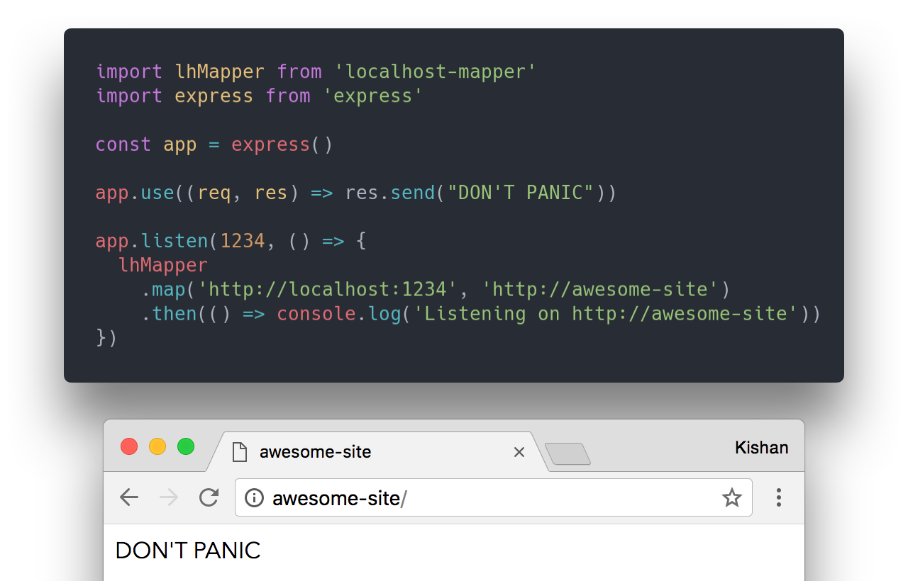

# 

🔗 Run your dev servers on addresses like `https://awesome-site/` or `https://🍔/`<sup>[1](#fn1)</sup> instead of ugly addresses like `http://localhost:1337`



You can run your localhost servers on practically any address like:  
`http://cat.meow/`  
`http://🍎🦄.👩‍💻/`<sup>[1](#fn1)</sup>  
`https://my.awesome.site/` ([HTTPS](#newAddress) will automatically be supported even if your original server listens only on HTTP)

Works on macOS and Windows, and [Linux with some manual config](#linux).

## Install

```sh
$ yarn add --dev localhost-mapper
```
or
```sh
$ npm i --dev localhost-mapper
```

## Usage

Import the module and use it like:
```js
import lhMapper from 'localhost-mapper'
// or const lhMapper = require('localhost-mapper')

// [...] your server code here [...]

const { PORT = 31415 } = process.env
lhMapper.map(`http://localhost:${PORT}`, 'http://awesome-site')
  .then(() => console.log('listening on http://awesome-site'))

// now open http://awesome-site in a browser
```

or type in the following in a terminal:
```sh
$ localhost-mapper http://localhost:31415 http://awesome-site
```

## How It Works

localhost-mapper works by creating a [Proxy Auto-Config (PAC)](https://en.wikipedia.org/wiki/Proxy_auto-config) file and automatically changing the PAC URL setting on Windows and macOS. The original setting is restored when localhost-mapper isn't being used.

<a name="linux"></a>
It's incompatible with [cURL][curl-pac] and Wget since they don't support PAC files. Also, automatic changing of the PAC URL hasn't been implemented for Linux, so you'll have to manually set the PAC URL for your browser or OS.

### Why not simply edit the `/etc/hosts` file?

The `hosts` file cannot map to different ports. So you can map `http://localhost:1337` → `http://unicorns:1337` easily but not `http://localhost:1337` → `http://unicorns` without listening on port 80. Listening on port 80 requires sudo.

Since you can only get one server to listen on port 80, the `hosts` file is limited to just a single mapping. With localhost-mapper, you can map as many hosts as you want simultaneously (`http://localhost:31415` → `https://alice`, `http://localhost:1234` → `http://bob`).

Manually editing the `hosts` file is a lot of work, compared to localhost-mapper which can be used by just adding a line of code that you can forget about. localhost-mapper will only be active when you run code that imports it. It'll restore all filesystem/network changes when it's not being used.

When you share your code, other people will have to manually edit the `hosts` file on their environment, but with localhost-mapper they can start using the prettified domain out of the box as soon as they run the code.

## API

#### `localhostMapper.map(originalAddress: String, newAddress: String|Array<String>|RegExp, [options: Object]): Promise<void>`

Forwards `originalAddress` to `newAddress` (`http://localhost:1337` → `http://cat.meow`). Aliased as `localhostMapper.add`.

##### `originalAddress: String`

The original address to be proxied/forwarded to `newAddress`. Like `http://localhost:1337`.

<a name="newAddress"></a>
##### `newAddress: String|Array<String>|RegExp`

The new address to listen on. Like `http://awesome-site`. Pass in an array of strings to listen on multiple addresses in one call. Also supports regex, like `/http\:\/\/.*everything\.awesome/`

If this starts with `https:`, self-signed certificates will be generated and a HTTPS server will be created that proxies `originalAddress`. So HTTPS will work even if `originalAddress` listens only on HTTP. To use your own certs, check out the `ssl` option below.
If you pass in a `RegExp` that matches HTTPS domains, you must set `ssl` to `true` to use automatically generate and use self-signed certificates.

##### `options: Object`

```js
{
  proxy: Boolean,
  proxyConfig: Object,
  ssl: {
    key: String,
    cert: String
  }
}
```

###### `proxy: Boolean`

By default, localhost-mapper proxies the contents of `originalAddress` so that the `Host` header is unchanged. This makes sure it is compatible with codebases that it wouldn't otherwise be without requiring changes. Setting this to `false` will disable proxying.

###### `proxyConfig: Object`

Passed as-is to [http-proxy](http-proxy). Only applicable when `proxy` is not `false`.

###### `ssl: { key: String, cert: String }`

Contents of key/cert file to use for HTTPS. Set this to `true` to automatically generate and use self-signed certificates.

#### `localhostMapper.unmap(newAddress: String|Array<String>|RegExp): Promise<void>`

Undos the `localhostMapper.map(...)` call, i.e. stops listening for `newAddress`. All addresses will automatically be removed when the node process exits. Aliased as `localhostMapper.remove`.

---

<a name="fn1">[1]</a>: While all browsers support emoji domains, not all show the actual emoji in the address bar. Safari will show the emoji like you'd want it to, while Chrome and Firefox will show the Punycode version: `http://xn--ui8h/`

## Acknowledgements

* [winproxy](https://github.com/getlantern/winproxy) for the executable to change PAC URL automatically in Windows (licensed under [Apache-2.0](https://github.com/getlantern/winproxy/blob/master/LICENSE))
* [hotel](https://github.com/typicode/hotel) for the inspiration

## License

MIT © [Kishan Bagaria](https://kishanbagaria.com)

[curl-pac]: https://curl.haxx.se/docs/faq.html#Does_curl_support_Javascript_or
[http-proxy]: https://www.npmjs.com/package/http-proxy
